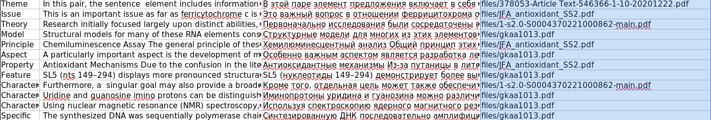

## Words_Searcher
### Download libs
* pip install -r requirements.
### Put pdf files in /files
### Launch rpdv3.py
* python3 rpdv3.py
### Inputs
* First input count of combinations for files
* Second input y/n to continue 
* Third inputs: 
  * y - select this sentence 
  * b - break this key word and go to next key word
  * enter - go to next
  * digital (for example 1, 2, 3)    
[Example]    
The rest of keywords: 45  
The rest of sentences: 2  (Word/Frase : Hence)  
The general problem may be instantiated with a wide and realistic range of goals and worlds  — and HENCE A WIDE RANGE OF FORMS OF INTELLIGENCE — CORRESPONDING TO DIFFERENT REWARD SIGNALS TO MAXIMISE IN DIFFERENT  ENVIRONMENTS.    
add? y/b (b=break) or prev number: 
   
The rest of keywords: 45  
The rest of sentences: 1  (Word/Frase : Hence)  
Uncertainty Certain Uncertain Uncertainty may be represented by stochastic initial states or transitions Termination Continuing Episodic Environment may terminate and reset to an initial state Stationarity Stationary Nonstationary Environment depends upon history and HENCE ALSO UPON TIME SYNCHRONICITY ASYNCHRONOUS SYNCHRONOUS OBSERVATION MAY REMAIN UNCHANGED UNTIL ACTION IS EXECUTED REALITY SIMULATED REALWORLD MAY INCLUDE HUMANS THAT INTERACT WITH AGENT 2.    
add? y/b (b=break) or prev number: 2    
<b>Here will be selected</b>:   
The general problem may be instantiated with a wide and realistic range of goals and worlds  — and HENCE A WIDE RANGE OF FORMS OF INTELLIGENCE — CORRESPONDING TO DIFFERENT REWARD SIGNALS TO MAXIMISE IN DIFFERENT  ENVIRONMENTS.

## Result

